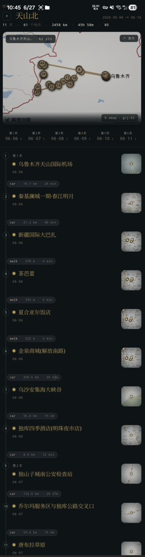

# LaC.Roadmap Plugin

English | [简体中文](README.zh-CN.md)

Life as Code - Roadmap is a travel planning and journaling plugin for Obsidian. Trips are stored as TOML inside Markdown — no database, no proprietary format, fully readable and editable on their own. Render them as a journal-style timeline with maps, day grouping, route segments, and a heatmap.



## Features

### 🎯 Core Features
- **Trip List + Trip Detail Views**: a roadmapset (collection) renders all trips with status dots, stats line, and per-trip cards; each trip opens into a vertical Field-Journal-style timeline
- **Day Grouping**: places are auto-grouped by date, with a quiet `DAY n / 11·01 / count` tab strip; multi-select tabs filter the timeline
- **Route Segments**: a `+ transit` chip between places opens an editor for travel mode (walk / bicycle / motorcycle / drive / transit), distance, duration, and tolls — with an "auto-calculate" button that calls Google Directions or AMap routing
- **Calendar Heatmap**: per-trip monochromatic-gold density strip showing where the trip's activity falls in time
- **Aggregate Map**: a hero map at the top of each page; click to expand into a pan/zoom-able read-only viewer
- **Recursive Structure**: a place file can simultaneously be the entry of a sub-roadmap (`type = "root"`, `renders = ["roadmap"]`), so a trip can contain nested trips
- **Place Reuse**: the same place file can be referenced by multiple trips; generic fields (name / description / address) live in the place file, while per-trip times live as overrides in the roadmap file
- **Export**: plain text itinerary, Markdown (paste back into Obsidian), `.ics` (calendar import), `.gpx` (GPS / outdoor apps)
- **Drag & Drop**: reorder places within a day; drag across day tabs to reassign date; auto-recompute affected route segments

### 🗺️ Dual Map Provider
- **Google Maps** for international trips (WGS84 coordinates)
- **AMap (高德)** for trips inside China (GCJ-02 coordinates)
- Per-trip `map_provider` overrides the global default — same vault can mix both seamlessly
- Coordinates auto-convert between WGS84 ↔ GCJ-02 based on the active provider

### 📊 Data Format

All data is TOML at the top of regular Markdown files, with `[[Wikilink]]` references for relationships. The plugin only rewrites the keys it owns and preserves leading comments.

**Roadmap collection root (`roadmap.md`):**
```toml
type = "root"
renders = ["roadmapset"]

[[Tokyo Trip]]
[[Kyoto Adventure]]
```

**Roadmap file (`Tokyo Trip.md`):**
```toml
name = "Tokyo Trip"

[detail]
description = "Akihabara + Asakusa"
start_time = "2025-11-01"
end_time = "2025-11-02"
map_provider = "google"

[[Akihabara]]
travelMode = "transit"
distance = 4800
duration = 1080
tolls = 240

[[Senso-ji Temple]]
```

The lines between two `[[wikilink]]` rows describe a route segment between those two places. The `travelMode` decides the polyline style (walk / bicycle render dashed; the rest solid) and colour.

**Place file (`Akihabara.md`):**
```toml
name = "Akihabara"

[detail]
start_time = "2025-11-01 10:00"
end_time = "2025-11-01 12:30"
description = "Electronics, anime, retro games"

[detail.address]
name = "Akihabara Station"
address = "1 Chome Sotokanda, Chiyoda City, Tokyo"
longitude = 139.7741
latitude = 35.6985
coordinate_system = "WGS84"
```

When a place is referenced by multiple trips, its own `start_time` / `end_time` are dropped and per-trip times live as override lines next to the wikilink in the roadmap file:

```toml
[[Akihabara]]
start_time = "2025-11-01 10:00"
end_time = "2025-11-01 12:30"
```

**Sub-roadmap as a place (`Day 2 in Kyoto.md`):**
```toml
type = "root"
renders = ["roadmap"]
name = "Day 2 in Kyoto"

[detail]
description = "Fushimi Inari + Gion"

[[Fushimi Inari Shrine]]
[[Gion District]]
```

The parent trip references this file as a regular `[[Day 2 in Kyoto]]` place; clicking the card navigates into it as a nested timeline.

### 🔧 Plugin Commands

1. **Open LaC.Roadmap** — open the trip list. The plugin will scaffold a sample roadmap collection on first run if the configured entry file does not exist.
2. **File Context Menu** — right-click any Markdown file → "Open with LaC.Roadmap" to open it as a roadmap entry (toggle in Settings).

### 📁 File Structure

```
LaC/Roadmap/
├── roadmap.md          # collection root: lists every trip
├── Tokyo Trip.md       # trip 1
├── Akihabara.md        # place referenced by Tokyo Trip
├── Senso-ji Temple.md
├── Kyoto Adventure.md  # trip 2
├── Day 2 in Kyoto.md   # sub-roadmap, also referenced as a place
├── Fushimi Inari Shrine.md
└── ...
```

### ⚙️ Settings

- **Entry File**: path to the roadmap collection root (default: `LaC/Roadmap/roadmap.md`).
- **Enable Context Menu**: show "Open with LaC.Roadmap" in Markdown file context menus.
- **Always Separate Place Schedule**: when a place is added to a trip, write its `start_time` / `end_time` as override lines on the roadmap file instead of into the place file. Default `true` — keeps place files reusable across trips.
- **Map API Provider**: `None` / `Google Maps` / `AMap (高德)`. `None` disables map widgets and falls back to plain text address fields.
- **AMap JS API Key**: required for the interactive map widget when AMap is selected. Get one from [AMap Open Platform](https://lbs.amap.com/) — apply for the "Web 端 (JS API)" platform.
- **AMap Web Service Key**: required for address search, geocoding, route calculation, and coordinate conversion. Apply for the "Web 服务" platform.
- **Google Maps API Key**: required when Google Maps is selected. Get one from [Google Cloud Console](https://console.cloud.google.com/) and enable Maps JavaScript API, Places API, Directions API, and Geocoding API.
- **Language**: Auto / 中文 / English.

## Installation

> This plugin does not go through the Obsidian Community Plugin review.

### Method 1: BRAT (recommended)
1. Install the BRAT plugin from Community Plugins.
2. Open BRAT settings.
3. Click "Add Beta plugin" and enter the repository: `alvinfunborn/lac-roadmap`.
4. Enable LaC.Roadmap in Community Plugins; BRAT will pull the latest release automatically and keep it updated.

### Method 2: Manual installation
1. Download the latest release archive from [GitHub Releases](https://github.com/alvinfunborn/lac-roadmap/releases).
2. Extract `main.js`, `manifest.json`, and `styles.css` into `<vault>/.obsidian/plugins/lac-roadmap/` (create the folder if missing).
3. Enable LaC.Roadmap in Settings → Community Plugins.

## Usage

### 1. First Open
Run "Open LaC.Roadmap" from the command palette. If the configured entry file is missing, the plugin scaffolds `LaC/Roadmap/roadmap.md` plus sample places so you can see the UI immediately.

### 2. Manage Trips
On the trip list page:
- **Add Trip**: click the bottom `+ NEW TRIP` button. A modal asks for name / description / dates / map provider.
- **Open Trip**: click any card. The same tab navigates into the trip detail (use the back button or `←` to return).
- **Reorder Wishlist**: trips without dates can be dragged to reorder; planned trips are sorted by date automatically.
- **Context Menu**: right-click (or long-press on touch) for "Remove from collection / Duplicate / Delete file (move to trash)".

### 3. Manage Places
On a trip detail page:
- **Add Place**: `+ ADD PLACE`. Pick name, time range, address. Address picker uses your configured map provider.
- **Add Nested Trip**: `+ ADD TRIP` creates a sub-roadmap that the parent references as a place.
- **Edit Route Segment**: click any chip between places (`walk · 4.8 km · 18 min`) to edit travel mode / distance / duration / tolls. The `auto-calculate` button uses your map provider's routing API.
- **Add Missing Segment**: chips marked `+ transit` between two consecutive places have no segment yet — click to create one.
- **Drag Places**: drag within a day to reorder; drag onto a day tab to move to that day; segments to/from the moved place are recomputed.

### 4. Day Tabs
- `DAY 1 / 11·01 / 3` — DAY ordinal, calendar date, place count.
- Click to multi-select; an empty selection or all-selected shows everything.
- `+ DAY` adds a session-only placeholder day (not persisted; for previewing how a future day's places would group).
- `wishlist` collects places without a date.

### 5. Hero Map
The map at the top of trip / trip-list pages is a preview. Click it to open a full read-only map viewer where you can pan / zoom / inspect markers. The hero is intentionally a preview because the warm-ink visual treatment doesn't pass through pointer events under Chromium — see `docs/PROGRESS.md` for the trade-off.

### 6. Export
On a trip detail page, the bottom `↓ EXPORT` menu offers four formats:
- **Copy plain text** — readable text itinerary.
- **Copy markdown** — Obsidian-pastable Markdown with stats table.
- **Download .ics** — calendar event file (import into Google Calendar / Apple Calendar / Outlook).
- **Download .gpx** — GPS exchange format for outdoor apps (auto-converts GCJ-02 → WGS84).

## Technical Implementation

- Obsidian Plugin API for file operations and view registration.
- React + TypeScript for the UI; Sortable.js for drag-drop.
- Lightweight TOML reader / writer that preserves leading comments and supports `[[wikilinks]]` inside the body.
- Provider abstraction (`IMapProvider` + `GoogleMapProvider` / `AmapProvider`) so all map widgets work identically against either provider.
- Coordinate conversion (WGS84 ↔ GCJ-02) applied at the provider boundary so place files keep their declared coordinate system.
- Field-Journal redesign tokens live in `styles/_variables.scss`; falls back to system serif / sans / mono fonts so no font assets are bundled and no network requests are made.
- 220+ Jest tests covering repositories, hooks, services, and integration paths.

## Architecture

Main components:

- `RoadmapPlugin` — plugin entry, view registration, settings tab.
- `RoadmapView` — Obsidian `ItemView` host; dispatches to `RoadmapSetPage` (collection root) or `RoadmapPage` (single trip) based on the file's `renders` field.
- `RoadmapSetPage` — trip list with hero aggregate map, status counts, drag-reorder for wishlist trips.
- `RoadmapPage` — trip detail with header / day tabs / timeline / actions.
  - `RoadmapHeader` — back button + serif title + stats + hero map.
  - `DayTabsStrip` — three-tier mono day tabs with long-press reorder.
  - `Timeline` — spine + numbered bullets + place cards + route chips.
  - `RoadmapActions` — `+ add place / + add trip / ↓ export` menu.
- `RoadmapRepository` — TOML parsing, place CRUD, sub-roadmap detection, route segment writes.
- `RouteCalculationService` — Google Directions / AMap routing wrapper.
- `RoadmapExportService` — plain / Markdown / ICS / GPX exporters.
- `MapSelector` — full-screen map modal (interactive picker + read-only viewer).
- `AggregatedMap` — hero map widget with warm-ink filter and overlay chrome.

## License

MIT License
